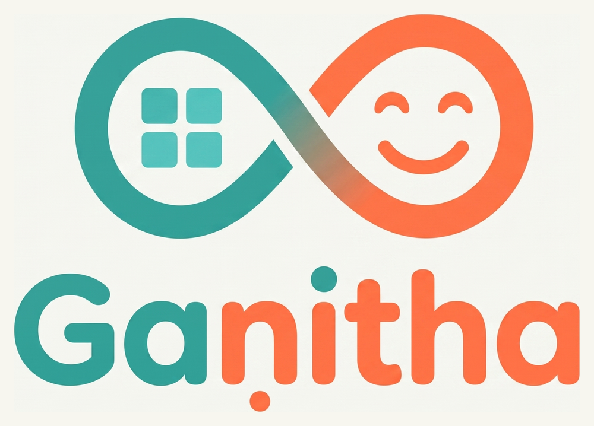

# Gaṇitha — welcome / landing page

Public landing page for **Gaṇitha**, a private, invitation-only math &amp; reasoning practice app.

- **Landing page:** served from GitHub Pages (this repo).
- **The app itself:** https://ganitha.web.app (invite-only; sign-in required).

Self-contained single `index.html` (no build step). Links visitors to the app and to
`support.ganitha@gmail.com` to request access. Brand-neutral; not affiliated with any test
publisher or testing organization.
